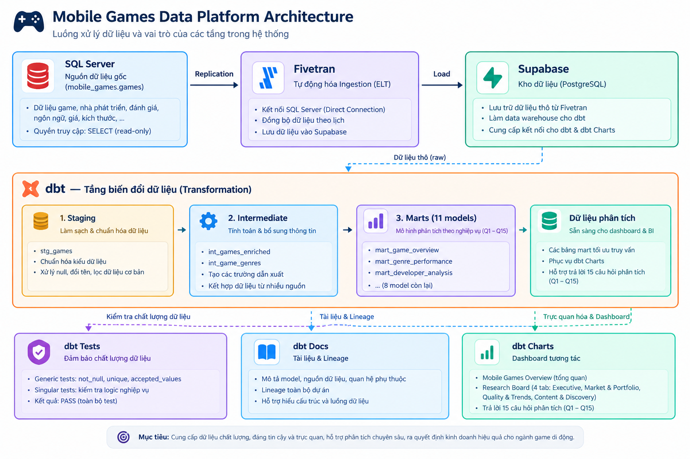
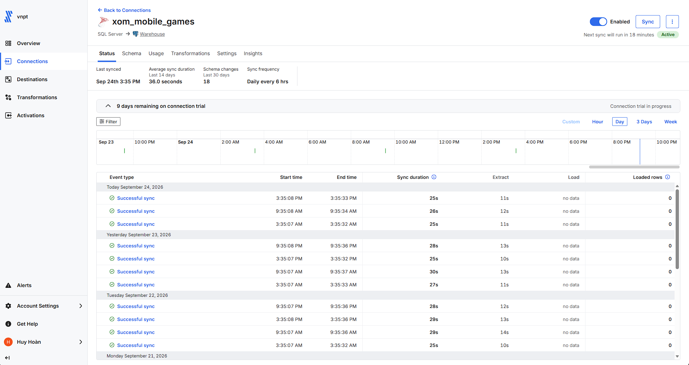
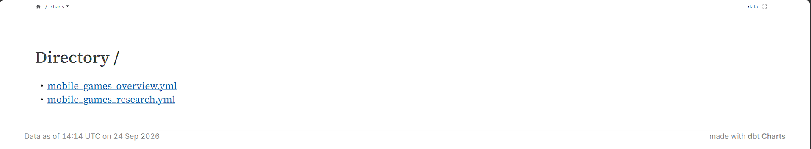

# Mobile Games Analytics Platform 🎮



> An end-to-end Analytics Engineering project built with **dbt Core**, **Fivetran**, and **Supabase** — transforming raw App Store catalog data into 15 answered business questions across 2 interactive dashboards.

---

## Problem Statement

Mobile game publishers and market researchers need reliable, structured analysis of the App Store catalog to understand genre dynamics, developer landscape, monetization patterns, and release trends — without access to transactional revenue or install data.

This project ingests a snapshot of the App Store mobile games catalog and applies a layered dbt transformation pipeline to produce trusted analytical marts, enabling repeatable, dashboard-driven insight across **15 predefined business questions**.

---

## Project Stats

| Metric | Value |
| :--- | :--- |
| Source columns | 16 |
| Source table grain | One row per App Store game (`app_id`) |
| dbt models | 1 staging · 2 intermediate · 11 marts |
| Business questions answered | 15 (Q1–Q15) |
| Dashboards | 2 (Overview + Research Board with 4 tabs) |
| dbt tests | Schema tests across all layers (unique, not_null, accepted_values) |
| Materialization | Staging → `view` · Intermediate → `view` · Marts → `table` |

---

## Data Pipeline

This platform processes mobile app store metadata through a 5-step modern data stack:

```
SQL Server (Source)
      │
      │  Fivetran (automated replication)
      ▼
Supabase PostgreSQL (Warehouse)
      │
      │  dbt Core (transformation)
      ▼
┌─────────────────────────────────────────────────────┐
│  Staging        →  Intermediate  →  Marts (× 11)   │
│  stg_games         int_games_enriched               │
│  (view)            int_game_genres  (view)           │
│                                       (table)        │
└─────────────────────────────────────────────────────┘
      │
      │  dbt Charts (BI layer)
      ▼
2 Dashboards · 4 Research Tabs · 15 Business Questions
```

**Fivetran connection** — automated replication from SQL Server to Supabase with `_fivetran_deleted` soft-delete handling at the staging layer:



**Supabase ingestion verified:**


---

## Dashboard Preview

### Executive Overview

High-level KPIs: total games in catalog, average user rating, total review volume, pricing mix, genre performance, top developers, and release trends.


### Research Board — 4 Tabs

A multi-tab analytical workspace covering all 15 business questions:

| Tab | Focus | Questions |
| :--- | :--- | :--- |
| **Executive** | Monetization, genre benchmarks, release trends | Q1, Q3, Q5, Q12 |
| **Market and Portfolio** | Developers, 2019 releases, size, localization, genre tags | Q2, Q4, Q8, Q9, Q13, Q15 |
| **Quality and Trends** | Game quality, age ratings, top titles, YoY growth, size vs rating | Q6, Q7, Q11, Q12, Q14 |
| **Content and Discovery** | Keyword analysis from game descriptions | Q10 |


---

## Key Findings

> Findings below are derived from the mart logic and chart definitions in this repository.
> Values marked `[VERIFY FROM DASHBOARD]` require live query execution to confirm exact numbers.

**1. Monetization — The catalog is predominantly free-to-play.**
The `mart_pricing` model classifies games into `Free` vs `Paid` using `price_usd = 0` as the boundary. Price bands for paid games range from sub-$1 to $20+.
- Free vs Paid split: `[VERIFY FROM DASHBOARD]` — see [Executive Tab → Q1 chart](charts/README.md)
- The majority of the catalog is free, with paid games concentrated in the $1–$4.99 band (Q5).

**2. Genre — Games are distributed across multiple primary genres, with uneven review engagement.**
`mart_genre_performance` computes per-genre game count, average rating, and average review count. Review count is used as the popularity proxy (no install data available).
- Highest avg review count genre: `[VERIFY FROM DASHBOARD]` — see [Executive Tab → Q3 chart](charts/README.md)
- Genre with highest avg rating: `[VERIFY FROM DASHBOARD]`

**3. Developer Landscape — A small number of developers dominate by portfolio size.**
`mart_developer_performance` ranks developers by game count (Q2). Q2 eligibility requires `q2_rank <= 10`.
- Top developer by game count: `[VERIFY FROM DASHBOARD]` — see [Market and Portfolio Tab → Q2 chart](charts/README.md)
- Q13 consistency analysis filters developers with ≥ 5 games and ≥ 100 reviews per game, ranking by rating standard deviation (lower = more consistent).

**4. Release Trends — 2019 appears as a prominent release year in the catalog.**
`mart_yearly_release_trends` tracks `games_released` and `yoy_growth_pct` per year using a LAG window function.
- Peak release year and volume: `[VERIFY FROM DASHBOARD]` — see [Quality and Trends Tab → Q12 chart](charts/README.md)
- `mart_release_2019_by_genre` specifically isolates 2019 releases by genre (Q4).

**5. Game Quality — High-performing titles require both high ratings AND meaningful review volume.**
`mart_game_performance` defines Q6 eligibility as `user_rating_count > 10,000` AND `average_user_rating IS NOT NULL`. This threshold ensures findings reflect games with real user engagement.
- Top 20 high-rated, high-reviewed games: `[VERIFY FROM DASHBOARD]` — see [Quality and Trends Tab → Q6 table](charts/README.md)
- Q11 uses a lower threshold (≥ 1,000 reviews) to rank the top 3 games per genre.

**6. Content & Language — "Puzzle" and "Multiplayer" are the two tracked gameplay keywords in descriptions.**
`mart_content_analysis` counts keyword mentions (`ilike '%puzzle%'`, `ilike '%multiplayer%'`) per genre.
- Genre with most puzzle mentions: `[VERIFY FROM DASHBOARD]` — see [Content and Discovery Tab → Q10 heatmap](charts/README.md)
- The `mentions_either` column captures games mentioning at least one of the two keywords.

---

## Project Highlights

| Design Decision | Rationale |
| :--- | :--- |
| **Intermediate layer** (`int_games_enriched`) | Centralizes shared enrichment logic (price classification, size conversion, language count parsing) reused by all 11 marts — avoids duplicating logic in each mart. |
| **Marts materialized as `table`** | Optimizes dashboard query performance. Staging and intermediate remain `view` to avoid storing transient data. |
| **`_fivetran_deleted` filter at staging** | Ensures soft-deleted source rows from Fivetran are excluded at the earliest layer, preventing downstream contamination. |
| **Window functions for ranking** | Q2 (developer rank), Q6 (high-rated rank), Q11 (genre rank), Q13 (consistency rank) all use `ROW_NUMBER()` / `STDDEV_SAMP()` directly in mart SQL — no post-processing needed in BI. |
| **Price bands defined in SQL** | Pricing tiers (Free / <$1 / $1–$4.99 / $5–$19.99 / $20+) are defined in `mart_pricing.sql`, making them consistent across Q1 and Q5 without BI-layer logic. |
| **`user_rating_count` as popularity proxy** | Dataset has no install or revenue data. Review count is the closest available engagement signal, documented explicitly in chart YAML `notes` fields. |

---

## Data Governance & Documentation

We use **dbt Docs** to maintain a navigable data catalog, column-level descriptions, and lineage graph for the full pipeline.




---

## Repository Structure

| Path | Purpose |
| :--- | :--- |
| [`BUSINESS_REQUIREMENTS.md`](BUSINESS_REQUIREMENTS.md) | Business context, Source Data Contract, and the full Q1–Q15 stakeholder questions table |
| [`models/`](models/README.md) | dbt transformation layers: Staging → Intermediate → Marts (architecture, logic, materialization) |
| [`charts/`](charts/README.md) | dbt Charts dashboard specs, tab layout, and Q-to-chart mapping |
| [`tests/`](tests/README.md) | Data quality test strategy and schema test coverage |
| [`images/`](images/) | Architecture diagrams and dashboard screenshots |
| [`dbt_project.yml`](dbt_project.yml) | dbt project config: model paths, materialization defaults |

---

## Quick Start

### Requirements
- Python 3.8+
- `dbt-postgres`
- Access credentials for the Supabase target database (configure in `profiles.yml`)

### Commands

```bash
# 1. Cài đặt packages dbt (nếu có dependencies)
dbt deps

# 2. Chạy toàn bộ pipeline: staging → intermediate → marts
dbt run

# 3. Kiểm tra chất lượng dữ liệu (unique, not_null, accepted_values)
dbt test

# 4. Sinh tài liệu và xem dbt Docs trên trình duyệt
dbt docs generate
dbt docs serve
```

> For detailed business context and the full list of stakeholder questions, see [`BUSINESS_REQUIREMENTS.md`](BUSINESS_REQUIREMENTS.md).
