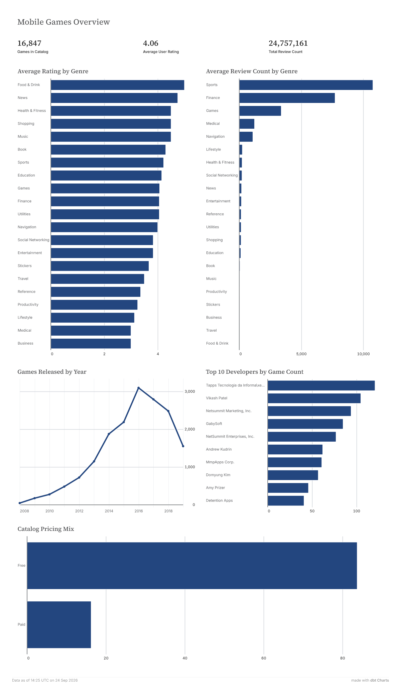
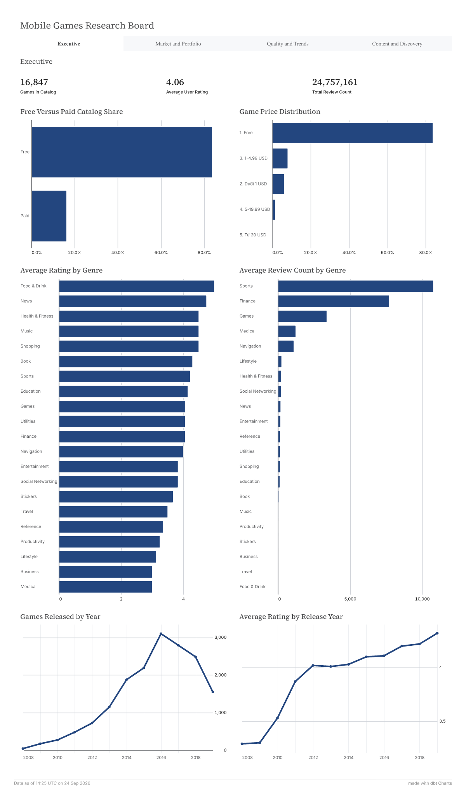
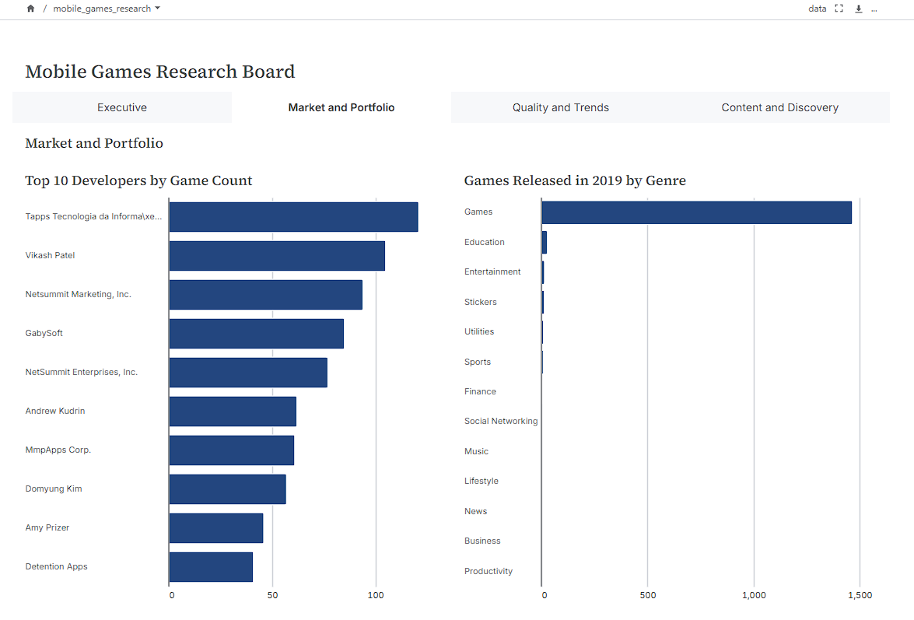
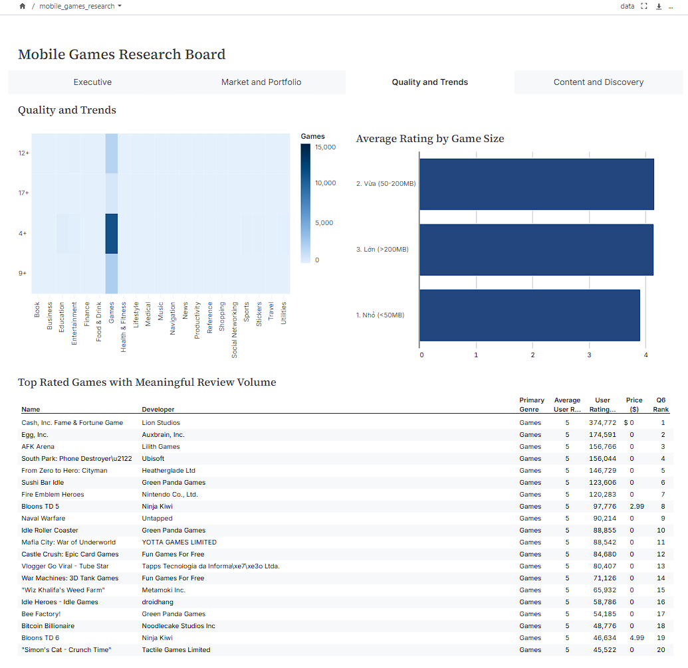
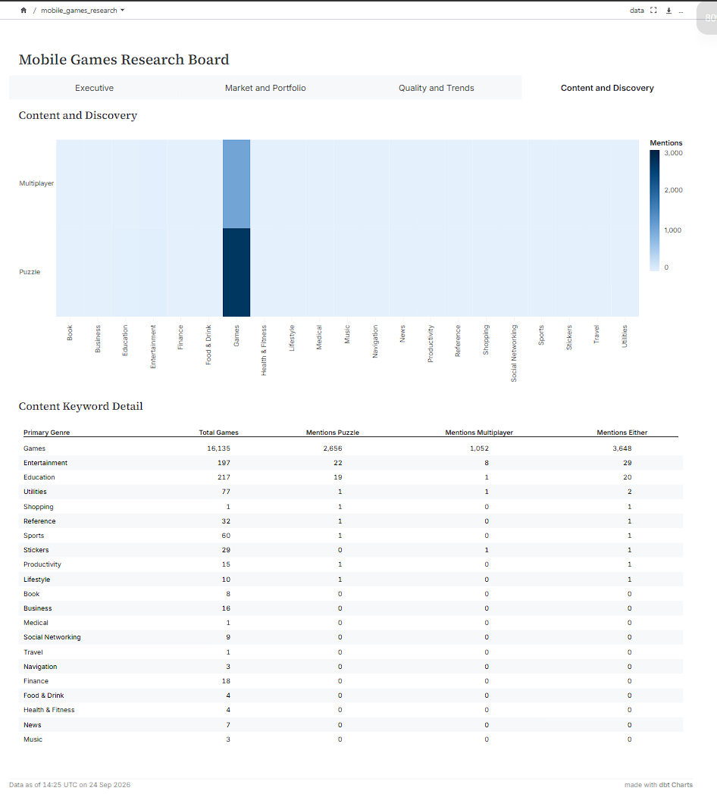

# BI & Dashboards (dbt Charts)

This directory contains the definitions for interactive BI dashboards built using **dbt Charts**. These dashboards sit directly on top of our dbt Marts, providing immediate insights into the mobile games market data.

## Directory Structure

```text
charts/
├── .gitkeep
└── README.md
```
*(Note: Actual YAML definitions for the charts are managed by the dbt Charts integration.)*

## Dashboard Specifications

The analytics presentation layer is divided into two primary dashboards to serve different analytical needs:

### 1. Executive Overview

Designed for leadership and quick at-a-glance health metrics. Provides high-level KPIs regarding catalog size, overall average ratings, and top-level market composition.

### 2. Market Research Board
A comprehensive, multi-tab dashboard directly addressing the 15 core business questions specified in the [BUSINESS_REQUIREMENTS.md](../BUSINESS_REQUIREMENTS.md).

#### Tab 1: Pricing & Monetization

Focuses on how games are monetized.
- **Answers:** Q1 (Free vs Paid), Q5 (Price distribution), Q6 (High-rated titles)

#### Tab 2: Genre & Developer

Explores market leaders and content categorization.
- **Answers:** Q2 (Top Developers), Q3 (Genre Performance), Q7 (Age Rating x Genre), Q11 (Top Games per Genre), Q13 (Developer Consistency), Q15 (Genre Tags)

#### Tab 3: Size & Localization

Analyzes technical characteristics and global reach.
- **Answers:** Q8 (Game Size by Genre), Q9 (Localization/Languages), Q14 (Size vs Rating correlation)

#### Tab 4: Release Trends & Content

Tracks historical market growth and marketing language.
- **Answers:** Q4 (2019 Peak Releases), Q10 (Description Keywords), Q12 (Year-over-Year Release Trends)

---

## How to View

If you have dbt Charts configured, you can preview these dashboards locally or view them deployed in your BI environment.

```bash
# Example command to serve dbt Charts locally (depending on your setup)
dbt-charts serve
```
