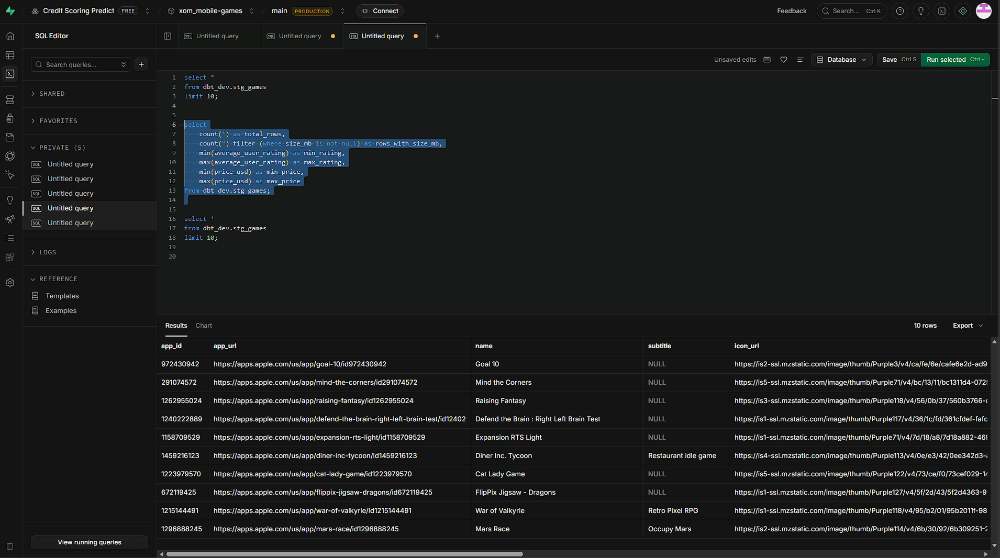

# tests/

This directory is the designated path for dbt test definitions in the Mobile Games Analytics Platform. It works in conjunction with YAML schema files co-located with each model.

---

## Role in the Project

The testing layer ensures data integrity across all three transformation layers. Tests run automatically as part of the dbt workflow and catch issues at the source boundary before they propagate to marts and dashboards.

---

## Test Strategy

This project uses **generic schema tests** only, defined in `.yml` files alongside each model. No custom singular SQL tests are used.

**Tests applied:**

| Test | Purpose |
| :--- | :--- |
| `unique` | Ensures primary keys have no duplicates (e.g., `app_id` in staging) |
| `not_null` | Ensures critical columns are never empty |
| `accepted_values` | Ensures categorical fields stay within defined domains |

Tests are defined in `.yml` files co-located with the models they test (e.g., `models/staging/mobile_games/stg_games.yml`, `models/marts/mobile_games/mart_pricing.yml`).

---

## Ingestion Verification

Before transformation runs, we verify that Fivetran successfully replicated data from SQL Server into Supabase PostgreSQL.



*(Supabase query confirming row presence after Fivetran ingestion)*

---

## Running Tests

```bash
# Run all tests across all layers
dbt test

# Run tests on a specific model
dbt test --select stg_games

# Run tests on the full marts layer
dbt test --select marts
```

All schema tests currently **PASS** across staging, intermediate, and all 11 marts.

For model-level column descriptions and test definitions, see the `.yml` files inside [`models/`](../models/).
